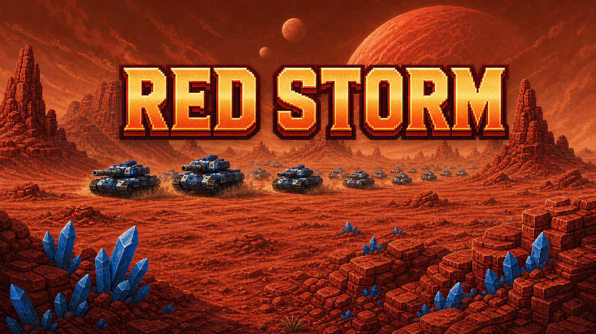
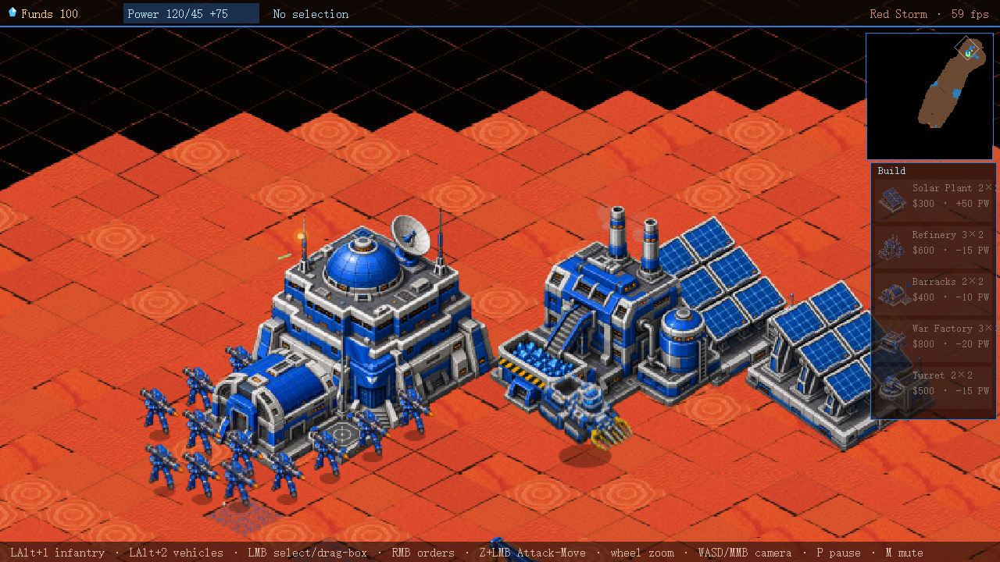
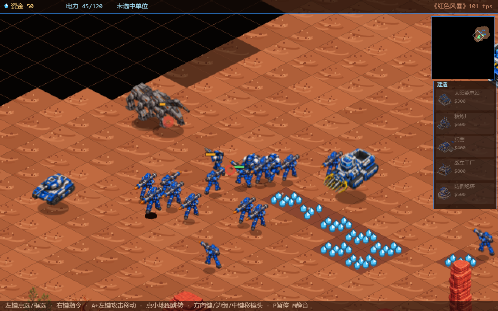
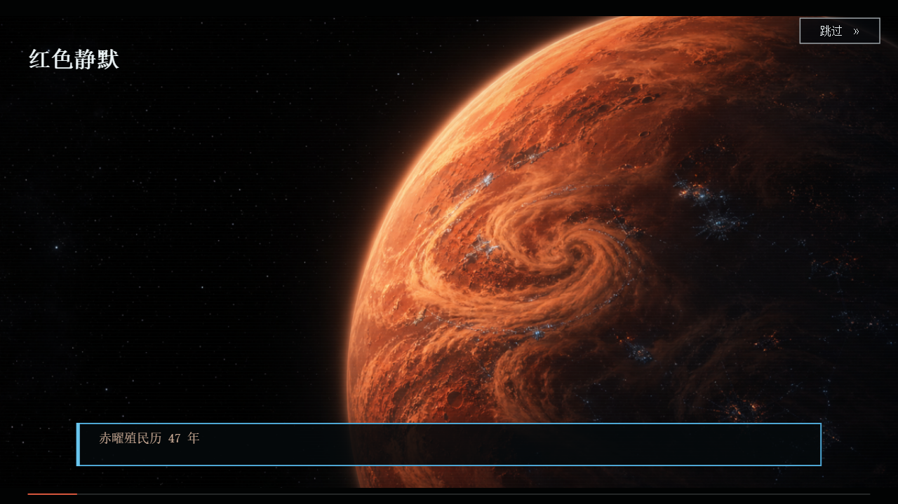
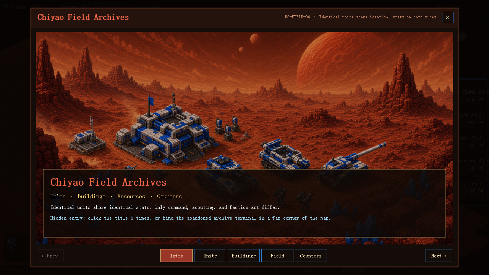

<p align="center">
  
</p>

<h1 align="center">Red Storm · 红色风暴</h1>

<p align="center">
  An original browser RTS created as a gift for my father.<br>
  一款献给父亲的原创浏览器即时战略游戏。
</p>

<p align="center">
  <a href="https://justin-yao.itch.io/red-storm"></a>
  
  
  <a href="LICENSE"></a>
</p>

> Build a base. Mine the red desert. Command tank columns. Survive the storm.

Red Storm is a zero-build, single-player real-time strategy game set on Chiyao, a red desert planet whose machines have stopped answering to anyone. It runs directly in a modern browser with no account, installation, network connection, telemetry, or data upload.

**[Play instantly on itch.io](https://justin-yao.itch.io/red-storm)** · **[Report a bug](https://github.com/justinzyc271828-sys/red-storm/issues/new?template=bug-report.yml)** · **[Share gameplay feedback](https://github.com/justinzyc271828-sys/red-storm/issues/new?template=gameplay-feedback.yml)**

## Why this exists

My father loves classic base-building RTS games. I wanted to understand what made those games memorable to him, so I built an original one of my own: a compact campaign and skirmish experience with mining, production, unit counters, fog of war, and large tank battles.

Red Storm is dedicated to Simon — the person it was built for.

## What is in the game

- **Three-chapter story campaign** with an opening cinematic, tactical briefings, battlefield radio messages, and multiple endings.
- **Fair AI economy**: the opponent mines the same ore, builds the same structures, and follows the same visibility rules as the player.
- **Command-style adaptation**: on Ultra Hard, the final chapter can counter the way you played earlier missions.
- **Skirmish and Sandstorm Mode** with three difficulties, deep drilling, obscured minimaps, and a contested relic mech.
- **A complete compact RTS loop**: economy, power, construction, production, scouting, unit counters, formations, combat, and post-match statistics.
- **English and Chinese UI**, switchable from the title screen at any time.

<p align="center">
  
  
</p>
<p align="center">
  
  
</p>

## Run locally

No build step is required.

1. Clone or download the repository.
2. Open `index.html` in a current version of Chrome, Edge, or Firefox.
3. Click **Enable Sound**. First-time players should begin with the in-game Tutorial.

If the browser restricts local pages, serve the folder instead:

```powershell
python -m http.server 8000
```

Then open `http://localhost:8000`.

## Controls

- **LMB**: select units, drag a selection box, or use build and production panels.
- **RMB**: move, attack, harvest, unload, or set a rally point.
- **Z + LMB**: attack-move.
- **Mouse wheel**: zoom. **WASD / arrows / middle-drag / screen edge**: move the camera.
- **Left Alt+1 / Left Alt+2**: select infantry or combat vehicles.
- **P**: pause. **M**: mute. **Esc**: cancel.

## Architecture

The game is intentionally small and direct: plain browser scripts loaded into the global `RS` namespace, with no bundler and no runtime dependency. Simulation modules remain DOM-free so the economy, pathfinding, combat, AI, and map rules can be tested in Node.

```text
config → art-data → iso → map → units → sprites → enemy-art
       → camera → input → game → combat → ai → audio → render → main
```

See [docs/ARCHITECTURE.md](docs/ARCHITECTURE.md) for module boundaries and testing notes.

## Tests

Install the one development dependency used by the art pipeline:

```powershell
npm ci
```

Run the canonical regressions individually from PowerShell:

```powershell
$tests = 'sim-test','path-test','build-test','prod-test','combat-test','ai-test','map-test','dom-test','review-m5','mech-test','i18n-test','onboarding-test','postmatch-test','field-guide-test','economy-test','audio-test','campaign-test'
foreach ($test in $tests) {
  node "test/$test.js"
  if ($LASTEXITCODE -ne 0) { exit $LASTEXITCODE }
}
```

Balance checks:

```powershell
node test/bot-match.js easy 10
node test/bot-match.js normal 10
node test/bot-match.js hard 10
```

## Contributing

Bug reports, focused gameplay feedback, documentation improvements, and well-tested code changes are welcome. Please read [CONTRIBUTING.md](CONTRIBUTING.md) before opening a pull request.

## License and asset rights

The **source code** is available under the [MIT License](LICENSE).

The artwork, music, sound effects, logo, campaign plates, and generated asset bundles are **not** licensed under MIT. They may be played and redistributed only as part of an unmodified complete Red Storm package under the terms in [ASSET-LICENSE.md](ASSET-LICENSE.md).

Artwork was created with assistance from GPT Image. Music and sound effects were created with Suno during a paid subscription, alongside procedurally synthesized audio. The project makes no claim that AI-assisted outputs are exclusive.

## 中文简介

《红色风暴》是一款献给 Simon 的原创网页即时战略游戏。它包含三章剧情战役、三档遭遇战 AI、沙暴遗迹争夺、双层经济、战争迷雾、兵种克制和完整战后统计。游戏无需安装、无需账号、不联网，也不会上传玩家数据。

想直接游玩，请前往 **[itch.io 浏览器版](https://justin-yao.itch.io/red-storm)**。想反馈问题或研究实现方式，可以使用本仓库的 Issues 与源码。
